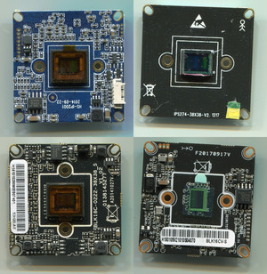

  

<h3 align="center">Boards catalog</h3>

---

HiSilicon based ip camera boards catalog

<em>Part of OpenHisiIpCam project</em>

## :pencil: Table of Contents
- [Quick links](#quick_links)
- [About](#about)
- [Getting Started](#getting_started)
- [Target hardware](#target_hardware)

## hi3516av100

|photo|vendor|model|SoC|CMOS|
|-----|------|-----|---|----|
||XM|[XM_53H20-S](boards/XM_53H20-S/)|hi3516cv100|Sony IMX122|
||XM|[XM_53H20-S](boards/XM_53H20-S/)|hi3516cv100|Sony IMX122|
||XM|[XM_53H20-S](boards/XM_53H20-S/)|hi3516cv100|Sony IMX122|

## hi3516av200

## hi3516cv100

## hi3516cv200

## hi3516cv300

## hi3516cv500

## hi3519av100

